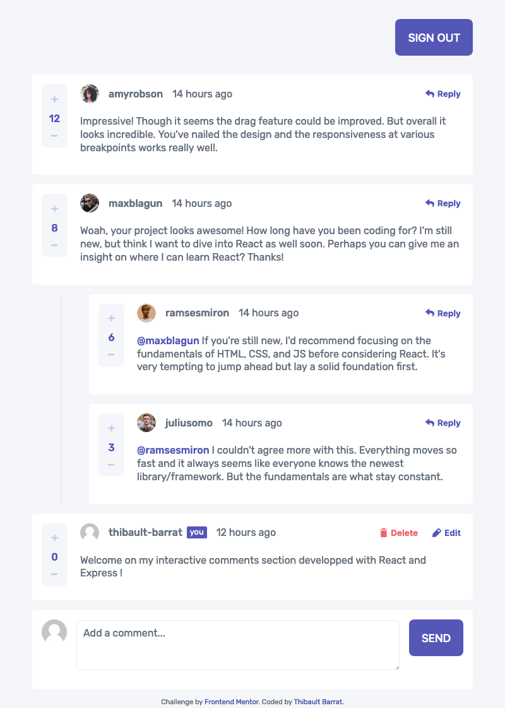

# Frontend Mentor - Interactive comments section solution

This is a solution to the [Interactive comments section challenge on Frontend Mentor](https://www.frontendmentor.io/challenges/interactive-comments-section-iG1RugEG9). Frontend Mentor challenges help you improve your coding skills by building realistic projects. 

## Table of contents

- [Frontend Mentor - Interactive comments section solution](#frontend-mentor---interactive-comments-section-solution)
  - [Table of contents](#table-of-contents)
  - [Overview](#overview)
    - [The challenge](#the-challenge)
    - [Screenshot](#screenshot)
    - [Links](#links)
  - [My process](#my-process)
    - [Built with](#built-with)
    - [What I learned](#what-i-learned)
    - [Useful resources](#useful-resources)
  - [Author](#author)

## Overview

### The challenge

Users should be able to:

- View the optimal layout for the app depending on their device's screen size
- See hover states for all interactive elements on the page
- Create, Read, Update, and Delete comments and replies
- Upvote and downvote comments
- **Bonus**: If you're building a purely front-end project, use `localStorage` to save the current state in the browser that persists when the browser is refreshed.
- **Bonus**: Instead of using the `createdAt` strings from the `data.json` file, try using timestamps and dynamically track the time since the comment or reply was posted.

### Screenshot

### Links

- Solution URL: [https://www.frontendmentor.io/solutions/comments-section-with-react-and-expressjs-backend-RVyc5MwCp](https://your-solution-url.com)
- Live Site URL: [https://interactive-comments-section-tb.netlify.app/](https://interactive-comments-section-tb.netlify.app/)

## My process

### Built with

- React.js
- SCSS module
- ExpressJS
- JWT
- TypeScript

### What I learned

With this challenge, I learned how to build an API with ExpressJS and deploy it to Heroku.
I also learned how to manage a Redux-like global state with React native hooks useContext and useReducer.

### Useful resources

- [Replace Redux with useReducer](https://javascript.plainenglish.io/replace-redux-with-usereducer-100406773332) - This helped me to use useReducer and useContext to replace Redux in TypeScript.
- [Node.js, Express.js, and PostgreSQL: CRUD REST API example](https://blog.logrocket.com/nodejs-expressjs-postgresql-crud-rest-api-example/) - This helped me to build my REST API with ExpressJS and PostgreSQL.

## Author

- Website - [Thibault Barrat](https://www.thibault-barrat.com/)
- Frontend Mentor - [@thibault-barrat](https://www.frontendmentor.io/profile/thibault-barrat)
- Twitter - [@Thib_Bar](https://www.twitter.com/Thib_Bar)